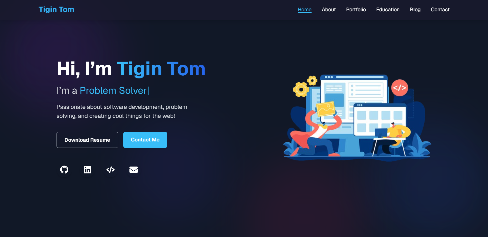

# Personal Portfolio Website - Tigin Tom

[](./LICENSE)
[](https://nextjs.org/)
[](https://tailwindcss.com/)
[](https://vercel.com/)

A sleek, modern, and fully responsive portfolio website built with **Next.js** and **Tailwind CSS** to showcase my skills, projects, and professional experience.

---

### 🚀 [**View Live Demo**](https://my-portfolio-liard-five-14.vercel.app/)


 


---

## ✨ Core Features

-   **Modern & Animated UI**: A clean, dark-themed design with smooth, subtle animations for an elegant user experience.
-   **Fully Responsive**: Optimized for a seamless experience on all devices, from mobile phones to desktops.
-   **Project Showcase**: A dedicated section to highlight my work, complete with live demo links and source code.
-   **Performance Optimized**: Built with Next.js for fast page loads, server-side rendering, and SEO benefits.
-   **Utility-First Styling**: Styled with Tailwind CSS for rapid, consistent, and maintainable UI development.

---

## 🛠️ Technology Stack

| Technology                                    | Description                              |
| --------------------------------------------- | ---------------------------------------- |
| **[Next.js](https://nextjs.org/)** | React framework for production apps.     |
| **[React](https://reactjs.org/)** | UI library for building components.      |
| **[Tailwind CSS](https://tailwindcss.com/)** | A utility-first CSS framework.           |
| **[Vercel](https://vercel.com/)** | Platform for hosting and deployment.     |

---

## ⚙️ Getting Started

To run a local copy of this project, please follow these steps.

### Prerequisites

-   Ensure you have **Node.js** installed (v18.x or higher is recommended).
-   A package manager like **npm** or **yarn**.

### Local Setup

1.  **Clone the repository:**
    ```bash
    git clone [https://github.com/Tigin-T-om/my-portfolio.git](https://github.com/Tigin-T-om/my-portfolio.git)
    ```

2.  **Navigate to the project directory:**
    ```bash
    cd my-portfolio
    ```

3.  **Install dependencies:**
    ```bash
    npm install
    ```

4.  **Run the development server:**
    ```bash
    npm run dev
    ```

Open **[http://localhost:3000](http://localhost:3000)** in your browser to see the result.

---

## 🌐 Deployment

This application is optimized for deployment on the [**Vercel Platform**](https://vercel.com/new). Vercel provides a seamless experience for Next.js applications, with automatic builds and deployments on every `git push` to your main branch.

For more details, see the [Next.js deployment documentation](https://nextjs.org/docs/app/building-your-application/deploying).

---

## 📜 License

This project is licensed under the **MIT License**. See the `LICENSE` file for more details.

---

## 📫 Get In Touch

**Tigin Tom** - [tigintomelanji@gmail.com](mailto:tigintomelanji@gmail.com)

**Project Link**: [https://github.com/Tigin-T-om/my-portfolio](https://github.com/Tigin-T-om/my-portfolio)
